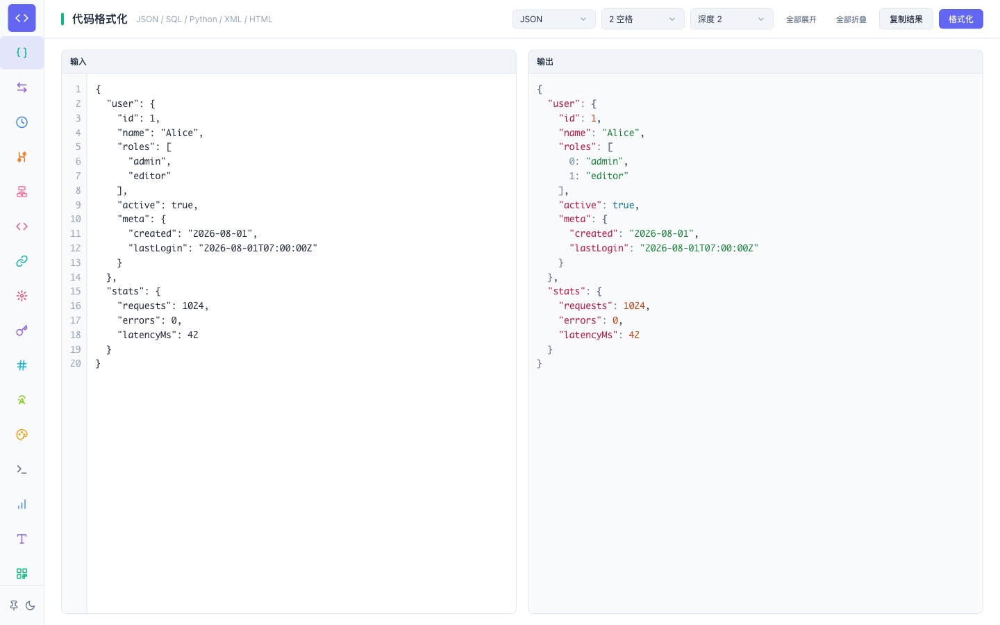
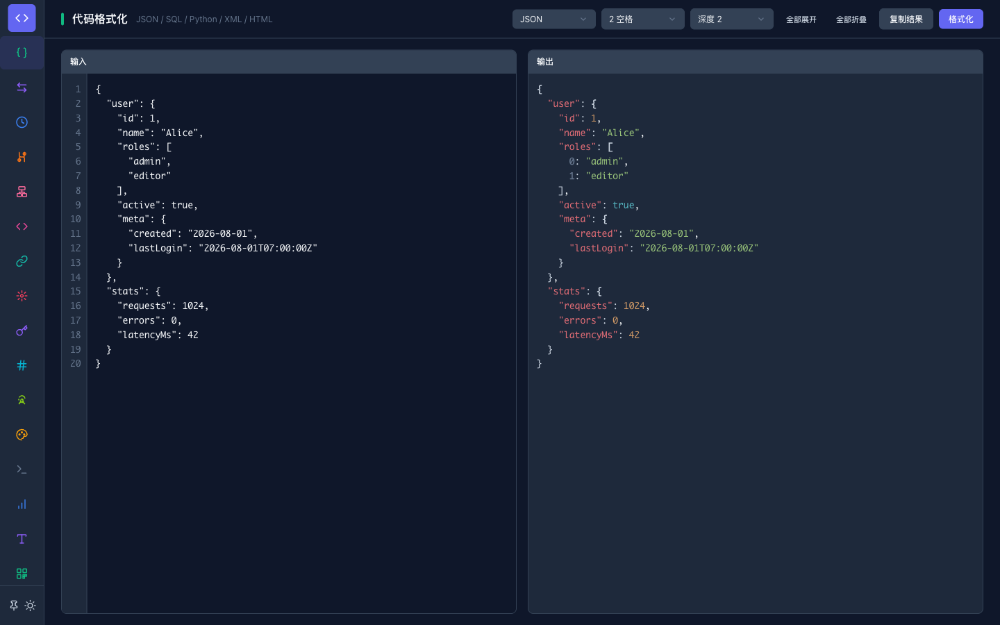
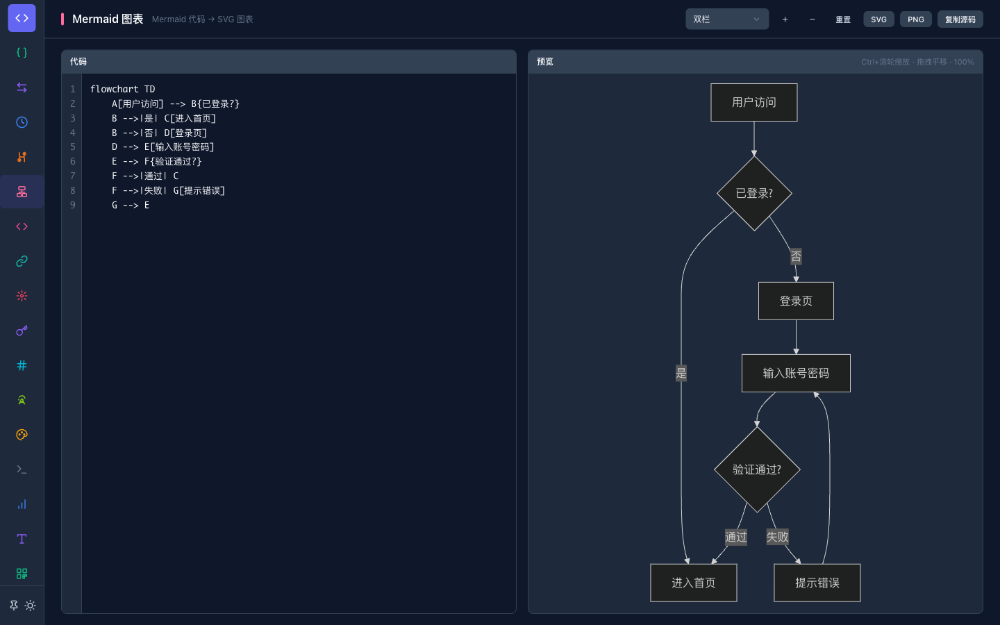
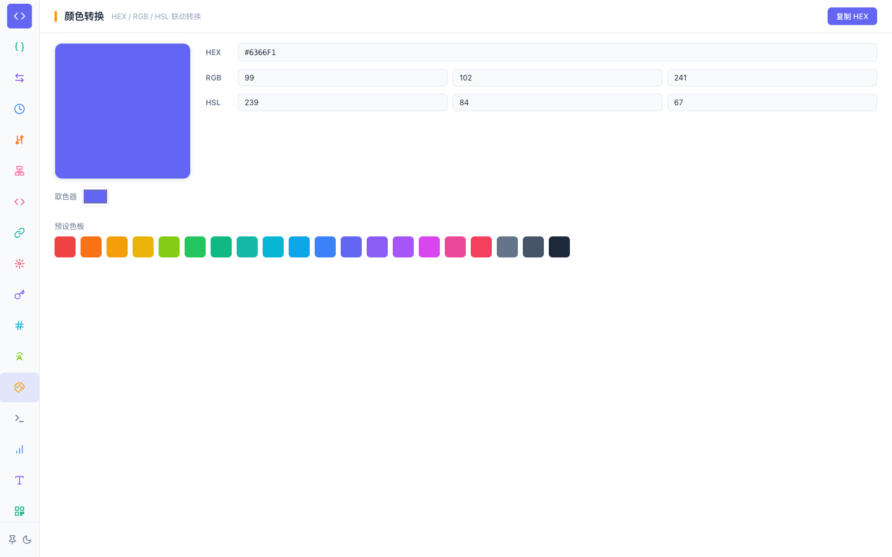

# 666Tools — Developer Toolbox

> **17 everyday developer utilities in one local-first desktop app.**
> No account. No telemetry. No network requests. Everything runs in your browser.

666Tools is a desktop utility collection for developers — formatting, encoding, conversion, debugging, and generation tools that process all data **locally** on your machine. Built with Vue 3 + Vite + TypeScript, packaged as a cross-platform desktop app with Tauri 2, and also runnable as a plain web app.

   [](https://github.com/Angryshark128/666tools/releases)

> 中文说明见 [README.md](./README.md) · **English**

## Screenshots

| Formatter · Light | Formatter · Dark |
|---|---|
|  |  |
| **Mermaid diagrams** | **Color converter** |
|  |  |

## Features

- **17 tools** — formatter, converter, time, diff, Mermaid, Base64, URL, regex, JWT, Hash, UUID, color, curl, text stats, case, QR code, radix
- **Local-first & private** — zero network calls from the tool logic; ideal for internal/sensitive data
- **Dark/light/system themes** with persistence
- **Copy feedback, swap, Cmd/Ctrl+Enter** shortcuts across tools
- **Auto line wrap** — all input/output editors soft-wrap long lines by default (line numbers hide when wrapping)
- **Syntax-highlighted output** — formatter and converter output panels get token-level highlighting (JSON/SQL/Python/XML/HTML/YAML)
- **Realtime computation** for Hash / Regex / Case / Radix / Curl / Color / JWT / Diff / Stats / UUID / QR / Mermaid
- **Input caching** for the formatter and Mermaid editors
- **Zero-dependency algorithms** — hand-written MD5, YAML & Python-dict parsers, JSON tree folding, LCS diff (see [`src/utils/`](./src/utils))

## Tools

| Category | Tool | Route |
|---|---|---|
| Format | JSON / SQL / Python / XML / HTML formatter with collapsible JSON tree | `#/json` |
| Convert | JSON ⇄ JSON String ⇄ YAML ⇄ Python Dict | `#/converter` |
| Time | Timestamp ⇄ date · duration conversion | `#/time` |
| Diff | LCS text / JSON / properties diff | `#/diff` |
| Diagram | Mermaid → SVG with zoom/pan/export | `#/mermaid` |
| Encode | Base64 · URL encode/decode | `#/base64` `#/url` |
| Debug | Regex tester · JWT parser (exp/iat) | `#/regex` `#/jwt` |
| Generate | Hash (MD5/SHA) · UUID v4 · QR code · radix | `#/hash` `#/uuid` `#/qr` `#/radix` |
| Dev | Color converter · curl → code (fetch/axios/python/go) · text stats · case converter | `#/color` `#/curl` `#/text-stats` `#/case` |

## Tech Stack

| Layer | Tech |
|---|---|
| Frontend | Vue 3 (Composition API), Vue Router 4, TypeScript (strict) |
| Build | Vite 8, `vue-tsc` type-checking |
| Desktop | Tauri 2 (shell plugin only) |
| Runtime libs | `mermaid`, `qrcode`, `sql-formatter` |

## Getting Started

### Prerequisites

- [Node.js](https://nodejs.org) ≥ 20
- (Desktop build only) [Rust](https://rustup.rs) + platform Tauri prerequisites

### Run in browser (dev)

```bash
npm install
npm run dev        # http://localhost:1420
```

### Run as desktop app

```bash
npm run tauri dev
```

### Build

```bash
npm run build       # type-check + web build → dist/
npm run tauri build # desktop installers
```

## Docker Deployment

A `Dockerfile` (Node build → Nginx static serve) and `docker-compose.yml` are included for containerized deployment of the web build.

```bash
# Option 1: docker compose (recommended)
docker compose up -d            # http://localhost:1420

# Option 2: docker build + run
docker build -t 666tools .
docker run -d --name 666tools -p 1420:80 666tools
```

- Default port mapping is `1420:80`; adjust `ports` in `docker-compose.yml` as needed.
- Routing uses hash mode (`#/json`), so no nginx SPA fallback is required; static assets are long-cached.
- `.dockerignore` excludes `node_modules` / `dist` / `src-tauri/target` to keep the build context small.

## Project Structure

```
src/
├── main.ts / App.vue / router.ts   # entry, root layout (Sidebar + router-view), lazy routes
├── styles/main.css                 # design system: CSS variables, reset, layout classes, syntax tokens
├── components/                     # Button / Select / CodeEditor / JsonView / ViewHeader / Sidebar …
├── utils/                          # pure functions — formatter, converters, md5, jsonTree, curl, case, color, radix …
└── views/                          # 17 tool pages
docs/
├── usage.md                       # usage guide (run modes / operations / shortcuts / tool reference)
├── deploy.md                      # deploy the web build to EdgeOne Pages
└── test-cases.md                   # full Playwright test manual for all tools
```

## Usage Guide

Detailed run modes (desktop / browser / Docker), UI operations, shortcuts, and per-tool reference: **[docs/usage.md](./docs/usage.md)**.

## Testing

The complete manual covers every tool with concrete steps and Playwright assertions: **[docs/test-cases.md](./docs/test-cases.md)**.

```bash
npm run dev   # then run Playwright against http://localhost:1420 following the manual
```

> Design & architecture reference: [Design.md](./Design.md)

## Release & Build Artifacts

**⬇️ [Download installers](https://github.com/Angryshark128/666tools/releases/latest)** — pick the build for your platform.

Pushing a `v*` tag triggers [`.github/workflows/release.yml`](./.github/workflows/release.yml), which builds and publishes a release with installers for:

| Platform | Architecture |
|---|---|
| macOS | x64 (Intel) · arm64 (Apple Silicon) |
| Windows | x64 · x86 (32-bit) |

`workflow_dispatch` also runs the build matrix manually without publishing. Installers are unsigned; macOS shows a Gatekeeper warning on first open.

For the web build: pushing a `v*` tag also triggers [`.github/workflows/web-dist.yml`](./.github/workflows/web-dist.yml), which builds a static artifact (`web-dist` downloadable from the Actions page). Upload it to EdgeOne Pages to go live — full guide in **[docs/deploy.md](./docs/deploy.md)**.

## Contributing

1. Fork & branch from `main`.
2. To add a tool: create `src/views/YourTool.vue`, register its route in `src/router.ts`, and add one entry to the `TOOLS` array in `src/components/Sidebar.vue` (icon + color).
3. Keep new logic in `src/utils/` as pure functions when possible — they are easy to unit-test.
4. Run `npm run build` (must pass) and verify the new/changed tool against `docs/test-cases.md`.
5. Open a PR with a short description.

## License

[MIT](./LICENSE)
